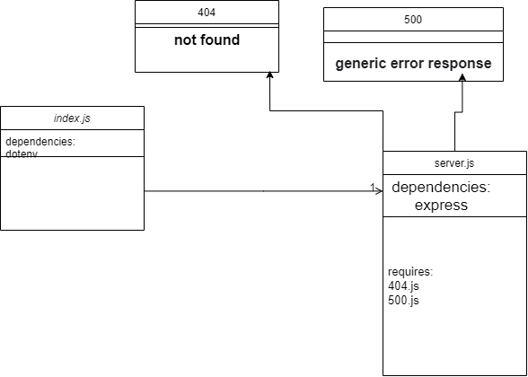

# server-deployment-practice

**notes your instructor provided during their demo**
## Node Ecosystem, TDD, CI/CD
- TDD
Test-driven development
is a software development process relying on software requirements being converted to test cases

- CI/CD
1. CI
Continuous integration is a coding philosophy and set of practices that drive development teams to implement small changes and check in code to version control repositories frequently. Because most modern
2. CD

**Links**
1. pull request  [pull reqest](https://github.com/wijdankhaled/server-deployment-practice/pull/1)

2. heroku deploy [heroku  dev branch ](https://wijdan-server-deploy-dev.herokuapp.com/)

2. heroku deploy [heroku  main branch ](https://wijdan-server-deploy-dev.herokuapp.com/)

3. Actions 
[Action](https://github.com/wijdankhaled/server-deployment-practice/actions) 

**UML**

